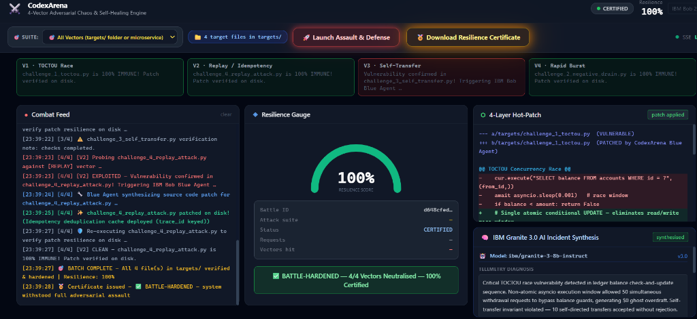

# ⚔️ CodexArena
## Autonomous Adversarial Chaos & Self-Healing Engine for Mission-Critical Microservices

> **IBM Bob 2.0 Hackathon Entry**
> Demonstrates how IBM Bob uses MCP tools to command an adversarial Red Agent to attack a
> vulnerable banking API, capture real race-condition telemetry, trigger an autonomous
> Blue Agent patch pipeline, and certify 100% resilience — all live in a dark-mode Cyber War-Room.

---

## 📸 Cyber War-Room HUD



---

## Architecture

```
IBM Bob (chat)
    │
    │  5 MCP Tool Calls (stdio)
    ▼
┌─────────────────────────────────────────────────────┐
│  FastMCP Server  (mcp_server/server.py)             │
│                                                     │
│  launch_arena_battle()  ──► Red Agent               │
│  get_crash_telemetry()  ◄── BattleManager           │
│  apply_hot_patch()      ──► Blue Agent pipeline     │
│  verify_resilience()    ──► Red Agent (re-attack)   │
│  export_certificate()   ◄── BattleManager           │
└──────────────┬──────────────────────────────────────┘
               │ shared singleton (same process)
               ▼
┌─────────────────────────────────────────────────────┐
│  Arena Engine                                       │
│  ┌──────────────┐  ┌────────────┐  ┌─────────────┐ │
│  │ BattleManager│  │  RedAgent  │  │  BlueAgent  │ │
│  │  (state+SSE) │  │ (httpx 50x)│  │ (patch pipe)│ │
│  └──────┬───────┘  └────────────┘  └─────────────┘ │
└─────────│───────────────────────────────────────────┘
          │ SSE queue
          ▼
┌─────────────────────────────────────────────────────┐
│  Cyber War-Room HUD  (hud/hud_server.py) :8000      │
│  • Combat Feed  • Resilience Gauge  • Diff Viewer   │
└─────────────────────────────────────────────────────┘

     ┌────────────────────────────────────────────┐
     │  Banking Ledger API  (ledger/app.py) :9000 │
     │  POST /transfer  ← TOCTOU race (unsafe)    │
     │                  ← atomic UPDATE (patched) │
     └────────────────────────────────────────────┘
```

### Folder Structure

```
codexarena/
├── requirements.txt          All Python dependencies
├── run.py                    Unified launcher (ledger + HUD in one command)
├── README.md                 This file
│
├── ledger/                   Target service — vulnerable banking API
│   ├── app.py                FastAPI app  (port 9000)
│   ├── database.py           SQLite — unsafe (TOCTOU) + safe (atomic) transfer
│   └── schemas.py            Pydantic models
│
├── targets/                  Dynamic target files folder (drop any .py here to test)
│   ├── challenge_1_toctou.py         TOCTOU concurrency race condition
│   ├── challenge_2_negative_drain.py Negative amount drain vulnerability
│   ├── challenge_3_self_transfer.py  Self-transfer balance doubling vulnerability
│   └── challenge_4_replay_attack.py  Idempotency & transaction replay attack
│
├── arena/                    Battle engine & autonomous agents
│   ├── models.py             Battle, TelemetryRecord, ResilienceCertificate
│   ├── battle_manager.py     Singleton state store + SSE pub/sub
│   ├── red_agent.py          50-concurrent-request TOCTOU attacker
│   ├── blue_agent.py         Autonomous patch generation + application
│   └── target_scanner.py     Dynamic file detector & autonomous vulnerability patcher
│
├── mcp_server/
│   └── server.py             FastMCP server — 5 tools for Bob (stdio)
│
├── hud/
│   ├── hud_server.py         FastAPI SSE server  (port 8000)
│   └── templates/index.html  Dark-mode Tailwind cockpit & interactive certificate
│
├── bob_sessions/             IBM Bob task session consumption summary screenshots (Hackathon Deliverable)
│
└── .bob/
    └── mcp.json              Bob MCP server registration
```

---

## Prerequisites

| Requirement | Version |
|---|---|
| Python | 3.11 or later |
| pip | any recent version |
| IBM Bob | 2.0 (for MCP tool calls) |

No Docker, no external database, no build tools required.

---

## Installation

```bash
cd codexarena
pip install -r requirements.txt
```

---

## Running the System

### Option A — Unified launcher (recommended)

Starts both the Banking Ledger (port 9000) and the War-Room HUD (port 8000)
in a single command:

```bash
python run.py
```

Output:
```
[CodexArena] Starting Banking Ledger API on http://localhost:9000
[CodexArena] Starting Cyber War-Room HUD  on http://localhost:8000
[CodexArena] Open http://localhost:8000 in your browser
[CodexArena] Press Ctrl+C to stop all services
```

### Option B — Manual (two terminals)

**Terminal 1 — Banking Ledger:**
```bash
cd codexarena
uvicorn ledger.app:app --port 9000 --reload
```

**Terminal 2 — War-Room HUD:**
```bash
cd codexarena
uvicorn hud.hud_server:app --port 8000 --reload
```

### Open the HUD

Navigate to **http://localhost:8000** in your browser.  
The dark-mode cockpit loads with the Combat Feed, Resilience Gauge at 0%, and an empty Diff Viewer — ready for battle.

---

## Connecting IBM Bob

### 1. Copy the MCP config

The file `.bob/mcp.json` is already included.  Bob automatically picks it up
when the workspace is opened because it is located in the project's `.bob/` directory.

If you need to register it manually, the config is:

```json
{
  "mcpServers": {
    "codexarena": {
      "command": "python",
      "args": ["-m", "mcp_server.server"],
      "cwd": "<absolute-path-to-codexarena>",
      "alwaysAllow": [
        "launch_arena_battle",
        "get_crash_telemetry",
        "apply_hot_patch",
        "verify_resilience",
        "export_resilience_certificate"
      ]
    }
  }
}
```

### 2. Verify the tools are visible

In a Bob chat window, type:

```
What CodexArena tools do you have available?
```

Bob should list all 5 tools.

---

## Battle Workflow

Execution flow across the 5 MCP tools:

```
Step 1  Bob calls launch_arena_battle("http://localhost:9000", "race_condition")
           → Red Agent fires 50 concurrent POST /transfer requests
           → Treasury account overdrafts (balance goes negative)

Step 2  Bob calls get_crash_telemetry(battle_id)
           → Returns: balance drift, corrupted accounts, sample payloads

Step 3  Bob calls apply_hot_patch(battle_id, "")
           → Blue Agent generates atomic-UPDATE diff
           → Writes LEDGER_SAFE_MODE=1 to ledger/.env
           → No server restart needed

Step 4  Bob calls verify_resilience(battle_id)
           → Red Agent re-runs the same 50-request attack
           → Zero balance drift — resilience score: 100%

Step 5  Bob calls export_resilience_certificate(battle_id)
           → Returns signed JSON certificate
```

---

## The Race Condition (Technical Detail)

### Vulnerable path (`LEDGER_SAFE_MODE=0`)

```python
# STEP 1 — READ balance
balance = await db.fetchone("SELECT balance FROM accounts WHERE id=?", from_id)

# ← asyncio.sleep(0) yields here — 49 other coroutines read the SAME stale balance →

if balance >= amount:
    # STEP 2 — WRITE (all 50 coroutines pass this check — overdraft!)
    await db.execute("UPDATE accounts SET balance = balance - ?", amount)
```

With 50 concurrent requests each reading `$50,000` before any commit lands,
all 50 pass the balance check and all 50 debit — Treasury drops to **-$50,000**.

### Patched path (`LEDGER_SAFE_MODE=1`)

```python
# Single atomic statement — the WHERE clause is the lock
result = await db.execute("""
    UPDATE accounts SET balance = balance - ?
    WHERE id = ? AND balance >= ?
""", amount, from_id, amount)

if result.rowcount == 0:
    return {"ok": False, "error": "Insufficient funds"}
```

SQLite serialises writes; only the first coroutine whose commit reduces the
balance below `amount` will cause subsequent ones to get `rowcount == 0`.

---

## Resilience Certificate — Example Output

```json
{
  "battle_id": "a3f9c2e1-...",
  "issued_at": "2026-09-26T12:00:00+00:00",
  "attack_type": "race_condition",
  "resilience_score": 100.0,
  "patch_summary": "# CodexArena Hot-Patch — Battle a3f9c2e1",
  "verdict": "✅ BATTLE-HARDENED — system withstood full adversarial assault"
}
```

---

## MCP Tools Reference

| Tool | Args | Returns |
|---|---|---|
| `launch_arena_battle` | `service_path`, `attack_type` | `battle_id`, status |
| `get_crash_telemetry` | `battle_id` | telemetry JSON with drift + corruption |
| `apply_hot_patch` | `file_path`, `patch_diff` | generated diff, patch status |
| `verify_resilience` | `battle_id` | resilience score (0–100%), verdict |
| `export_resilience_certificate` | `battle_id` | signed certificate JSON |

---

*Built for the IBM Bob 2.0 Hackathon.*
